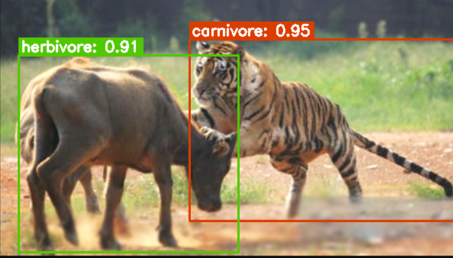
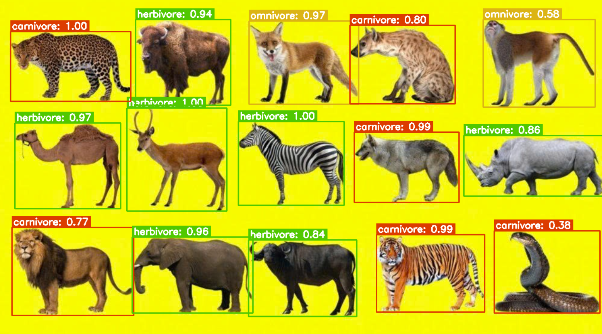

# Animal Recognition and Classification System Based on Feeding Habits

## Overview

This project presents a Deep Learning-based system for recognizing animals in images and classifying them according to their feeding habits.

The system consists of two main stages:

1. **Animal Detection** using **MegaDetector**
2. **Feeding Habit Classification** using a custom deep learning model

The classification categories include:

-  **Carnivore** – Meat-eating animals
-  **Herbivore** – Plant-eating animals
-  **Omnivore** – Animals that consume both plants and meat

---

# Project Structure

```text
.
├── data/                      # Dataset
├── image_test/                # Input images for testing
├── result/                    # Prediction results
├── train_model/               # Saved model weights
├── animal_detection.py        # Animal detection with MegaDetector
├── awa2_preprocess_3class.py  # Dataset preprocessing
├── chia_train_test.py         # Train/Test split
├── dataset.py                 # Dataset loader
├── image_test.py              # Image testing script
├── model.py                   # Classification model
├── pipeline.py                # Complete inference pipeline
├── test_model.py              # Model evaluation
├── train_model.py             # Model training
├── MergeLabel.md
└── README.md
```

---

# Dataset

The project uses the **Animals with Attributes 2 (AwA2)** dataset.

Before training, animal classes are merged into three feeding-habit categories:

| Category | Description |
|----------|-------------|
| Carnivore | Meat-eating animals |
| Herbivore | Plant-eating animals |
| Omnivore | Animals that eat both plants and meat |

Dataset preprocessing includes:

- Image organization
- Label merging
- Train/Test splitting
- Image resizing
- Data normalization

---

# Requirements

- Python 3.9+
- PyTorch
- Torchvision
- OpenCV
- Pillow
- NumPy
- MegaDetector

Install dependencies:

```bash
pip install torch torchvision opencv-python pillow numpy megadetector
```

---

# Model Weights

Because the trained model is too large for GitHub, it is available on Google Drive.

**Download Link**

https://drive.google.com/drive/folders/1n1PWg1MIrxMQ-H-fRxsEgTM72qOcvI_0?usp=sharing

After downloading, place the weight files in the appropriate directories required by the project.

---

# Running the Project

Place testing images into:

```text
image_test/
```

Run the complete pipeline:

```bash
python pipeline.py
```

The prediction results will be saved in:

```text
result/
```

---

# Inference Pipeline

```text
Input Image
      │
      ▼
MegaDetector
(Animal Detection)
      │
      ▼
Crop Animal Region
      │
      ▼
Image Preprocessing
      │
      ▼
Deep Learning Classifier
      │
      ▼
Prediction
 ├── Carnivore
 ├── Herbivore
 └── Omnivore
      │
      ▼
Save Result
```

---

# Example Results

## Example 1
  

## Example 2

  
---
# Features

- Animal detection using MegaDetector
- Automatic cropping of detected animals
- Image preprocessing
- Deep Learning-based classification
- Three-category feeding habit prediction
- Batch image inference
- Save prediction results automatically

---


# Output

For every input image, the system will:

- Detect animal locations
- Crop detected animals
- Predict feeding habit
- Save the prediction result in the `result/` directory

---


